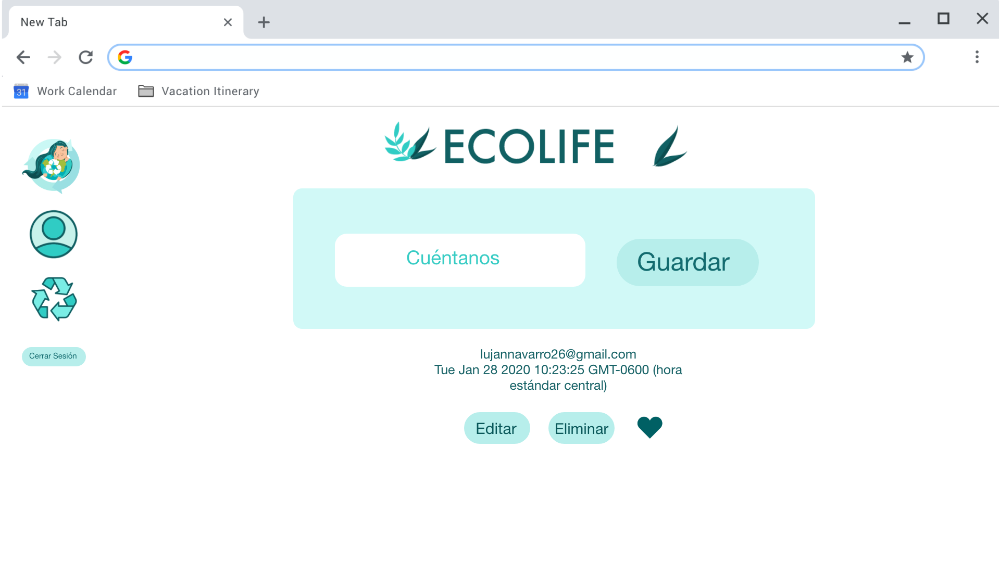

# Creando una Red Social: "EcoLife"

## Índice
* [1. Definición del producto](#1-Definición-del-producto)
* [2. Historias de Usuario](#1-Historias-de-Usuario)
* [3. Prototipo de baja fidelidad](#3-Prototipo-de-baja-fidelidad)
* [4. Prototipo de Alta fidelidad](#4-Prototipo-de-alta-fidelidad)
* [5. Testeos de Usabilidad](#5-Testeos-de-Usabilidad)

***

## 1. Definición del proyecto.

Ecolife fue diseñado como un blog de referencia para aprender y compartir trucos caseros y mucho DIY para llevar una vida ecológica, reducir tu consumo y aprender sobre cosmética natural y plantas medicinales.

## 2. Historias de usuario.

### Historia 1
#### Yo como: 
Usuario nuevo
#### Quiero:
Crear una cuenta con email y password
#### Para:
poder iniciar sesión e ingresar a la red social
##### Criterios de Aceptación de la HU
- Primer pantalla con tematica y diseño establecidos.
- Nombre de la red social con logotipo.
- Mensaje de bienvenida-
- Dos espacios input de texto para email y password.
- Botón Iniciar sesión.

### Historia 2
#### Yo como:
Usuario nuevo
#### Quiero:
Tener la opción de iniciar sesión con mi cuenta de Google y GitHub
#### Para:
Ingresar a la red social sin necesidad de crear una cuenta con email y password
##### Criterios de Aceptación de la HU
- Botones para iniciar sesión con Google y GitHub

### Historia 3
#### Yo como:
Usuario loggeado 
#### Quiero:
Debo poder crear, guardar, modificar y eliminar una publicación (post)
#### Para:
Interactuar con la red social
##### Criterios de Aceptación de la HU
- Vizualizar el cuadrante del post.
- Tener botones para guardar el post, editar el post y eliminar el post.

### Historia 4
#### Yo como:
Usuario loggeado 
#### Quiero:
Visualizar los datos de mi perfil
#### Para:
Modificar mi nombre y teléfono en caso de así quererlo
##### Criterios de Aceptación de la HU
- Vizualizar mis datos.
- Botón para editar mis datos.

### Definición de Terminado Del Proyecto
- La funcionalidad cumple satisface los criterios de aceptación.
- El diseño visual corresponde al prototipo de alta fidelidad.

## 3. Prototipo de baja fidelidad.

## 4. Prototipo de alta fidelidad.

